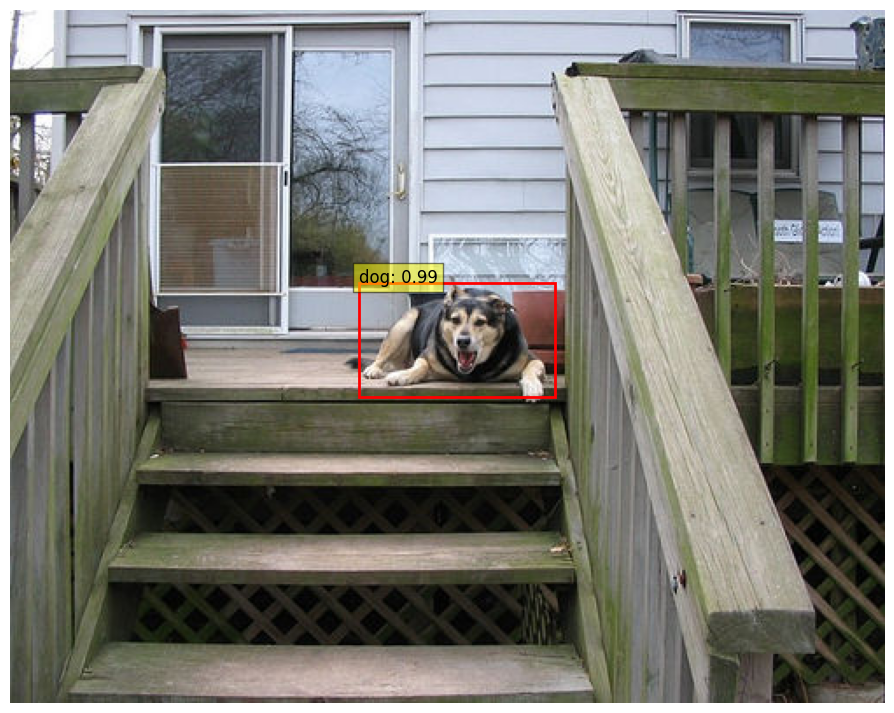
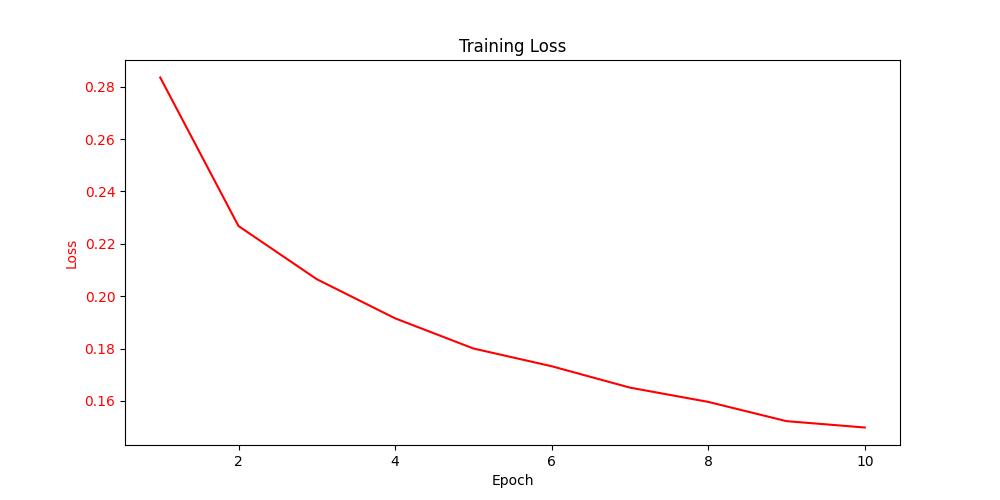

# Faster R-CNN Object Detection System

English  /  [中文](readme_zh.md)

↑ 点击切换语言

This project implements an object detection model based on Faster R-CNN using a pre-trained ResNet50 as the backbone network.

Due to limited computational resources, this project only trained on the animal-related portion of the VOC2012 dataset, and the number of training epochs is set to 10.

Additionally, detailed annotations are provided to assist those who understand the theoretical knowledge but are not familiar with coding.





## Table of Contents

- [Multilingual Annotations](#multilingual-annotations)
- [Dataset](#dataset)
- [File Structure](#file-structure)
- [Notes](#notes)
- [Contributions](#contributions)

## Multilingual Annotations

To make the code easier to understand for developers from different language backgrounds, the annotations in this project are provided in both English and Chinese.

## Dataset

This project uses the PASCAL VOC2012 dataset.

The PASCAL VOC dataset is one of the widely used standard datasets in the field of computer vision, primarily for tasks such as object detection, image segmentation, and image classification.

For more information, please refer to the [PASCAL VOC Official Website](http://host.robots.ox.ac.uk/pascal/VOC/).

## File Structure

The file structure of the project is as follows:

```c++
Sports_Recognition
│
├── data/
│   └── VOC2012
│
├── model/
│   ├── model.pt
│   ├── training.log
│   └── training_metrics.csv
│
├── utils(en/zh)/
│   ├── __init__.py
│   ├── data_loader.py
│   ├── data_process.py
│   ├── faster_rcnn.py
│   ├── metrics.ipynb
│   ├── test.ipynb
│   └── train.py
│
└── main.py 
```
## Notes

Due to GitHub's file upload limit of 25MB, I cannot upload the processed dataset and model to this project. Therefore, only the code and ideas are provided here. Apologies for the inconvenience.

## Contributions

All forms of contributions are welcome! Whether it's reporting bugs or making suggestions, thank you very much!!

