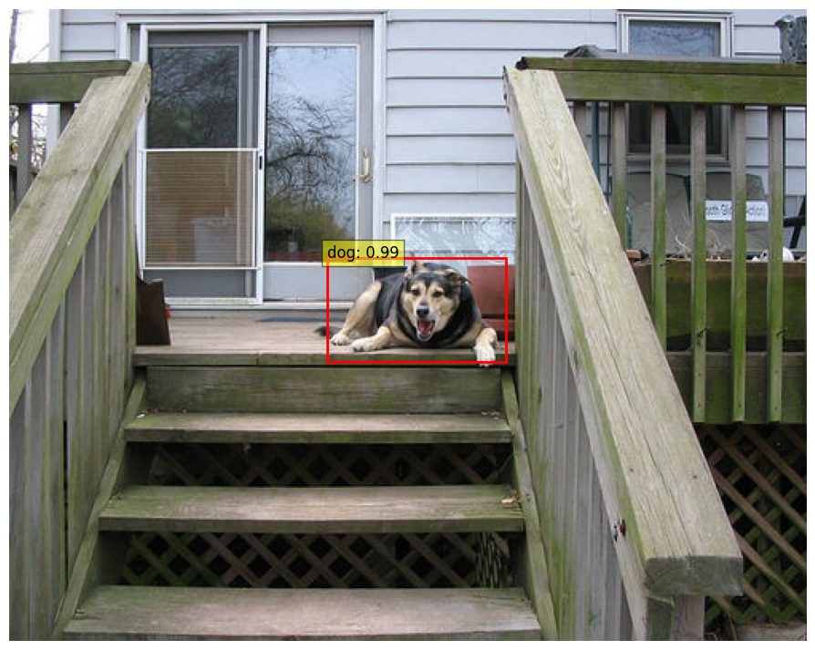
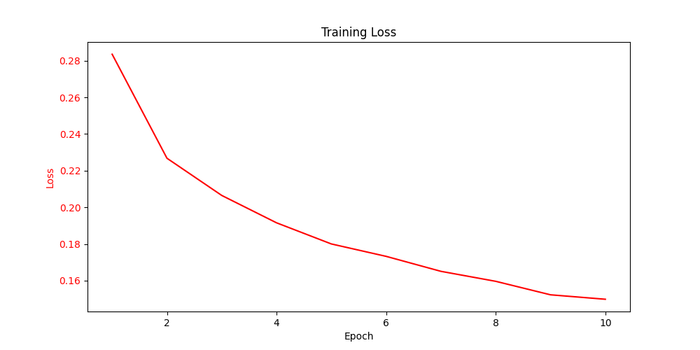

# Faster R-CNN 目标检测系统

[English](readme_zh)  /  中文

↑ Click to switch language

本项目实现了一个基于 Faster R-CNN 的目标检测模型 使用预训练的 ResNet50 作为基础骨架网络。

由于计算资源有限 本项目仅训练了 VOC2012 数据集中与动物相关的部分 并将训练轮数设定为 10 轮。

同时进行了较为详细的注释 方便一些懂得理论知识但不懂如何写代码的朋友进行参考





## 目录

- [多语言注释](#多语言注释)
- [数据集](#数据集)
- [文件结构](#文件结构)
- [注意事项](#注意事项)
- [贡献](#贡献)

## 多语言注释

为了让不同语言背景的开发者更容易理解代码 本项目的注释提供了英文和中文两种版本

## 数据集

本项目使用了 PASCAL VOC2012 数据集 

PASCAL VOC 数据集是计算机视觉领域中广泛使用的标准数据集之一 主要用于目标检测 图像分割和图像分类等任务

更多信息请参考 [PASCAL VOC官网](http://host.robots.ox.ac.uk/pascal/VOC/)

## 文件结构

项目的文件结构如下

```c++
Sports_Recognition
│
├── data/
│   └── VOC2012
│
├── model/
│   ├── model.pt
│   ├── training.log
│   └── training_metrics.csv
│
├── utils(en/zh)/
│   ├── __init__.py
│   ├── data_loader.py
│   ├── data_process.py
│   ├── faster_rcnn.py
│   ├── metrics.ipynb
│   ├── test.ipynb
│   └── train.py
│
└── main.py 
```

## 注意事项

因为 GitHub 的文件上传最大为 25MB 所以我无法将处理后的数据集和模型上传到该项目 所以这里仅提供代码和思路 抱歉

## 贡献

欢迎所有形式的贡献！无论是报告错误还是提出建议 非常感谢！！